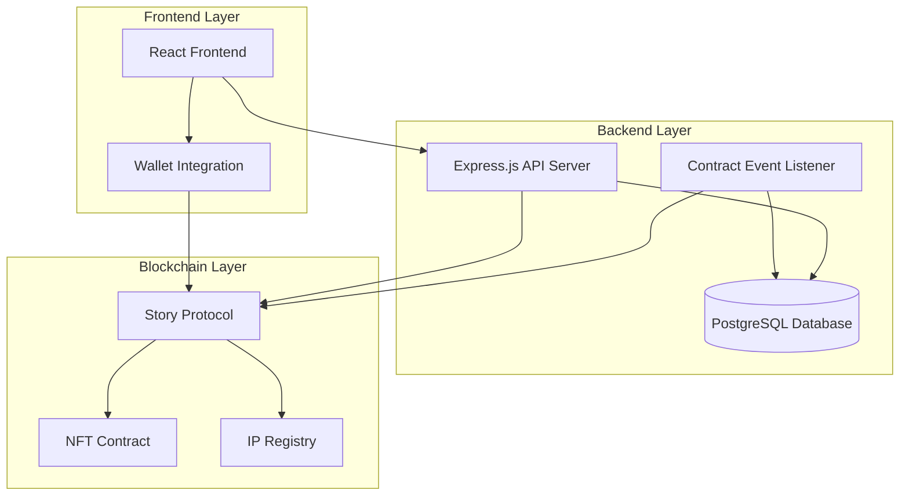

# Design Document

## Overview

The NFT/IP Creation dApp is a full-stack decentralized application built on the Story Protocol that enables atomic NFT minting and IP registration. The system consists of a React frontend, Node.js backend API, PostgreSQL database, and smart contract integration using the Story Protocol SDK. The architecture ensures data consistency between blockchain state and application database through event-driven synchronization.

## Architecture



### Technology Stack

- **Frontend**: React 18, Next.js 14, TailwindCSS, Wagmi/Viem for Web3 integration
- **Backend**: Node.js, Express.js, TypeScript
- **Database**: PostgreSQL with Prisma ORM
- **Blockchain**: Story Protocol SDK, Ethereum/Story testnet
- **Event Processing**: WebSocket connections for real-time updates

## Components and Interfaces

### Frontend Components

#### NFTCreationForm Component
```typescript
interface NFTCreationFormProps {
  onSubmit: (metadata: NFTMetadata) => Promise<void>;
  isLoading: boolean;
  error?: string;
}

interface NFTMetadata {
  title: string;
  description: string;
  image: File;
  attributes: Array<{trait_type: string; value: string}>;
  royaltyPercentage: number;
  royaltyRecipient: string;
}
```

#### TransactionStatus Component
```typescript
interface TransactionStatusProps {
  status: 'idle' | 'pending' | 'success' | 'error';
  transactionHash?: string;
  nftId?: string;
  ipId?: string;
  error?: string;
}
```

#### NFTDisplay Component
```typescript
interface NFTDisplayProps {
  nft: {
    id: string;
    ipId: string;
    metadataUri: string;
    creator: string;
    royalties: number;
    transactionHash: string;
    createdAt: Date;
  };
}
```

### Backend API Endpoints

#### POST /api/nft/create
```typescript
interface CreateNFTRequest {
  metadata: NFTMetadata;
  creatorWallet: string;
  signature: string;
}

interface CreateNFTResponse {
  success: boolean;
  transactionHash: string;
  nftId?: string;
  ipId?: string;
  error?: string;
}
```

#### GET /api/nft/:id
```typescript
interface GetNFTResponse {
  nft: {
    id: string;
    ipId: string;
    metadataUri: string;
    creator: string;
    royalties: number;
    transactionHash: string;
    metadata: NFTMetadata;
    createdAt: Date;
  };
}
```

#### GET /api/creator/:wallet/nfts
```typescript
interface GetCreatorNFTsResponse {
  nfts: Array<{
    id: string;
    ipId: string;
    metadataUri: string;
    royalties: number;
    transactionHash: string;
    createdAt: Date;
  }>;
  pagination: {
    page: number;
    limit: number;
    total: number;
  };
}
```

### Smart Contract Interface

#### Story Protocol Integration
```typescript
interface StoryProtocolService {
  createAndRegisterIP(
    metadata: NFTMetadata,
    creatorWallet: string
  ): Promise<{
    transactionHash: string;
    nftId: string;
    ipId: string;
  }>;
  
  getIPDetails(ipId: string): Promise<IPDetails>;
  getNFTDetails(nftId: string): Promise<NFTDetails>;
}

interface IPDetails {
  id: string;
  owner: string;
  metadataUri: string;
  royalties: RoyaltyConfig;
  registrationDate: Date;
}
```

## Data Models

### Database Schema

#### NFT_IP Table
```sql
CREATE TABLE nft_ips (
  id SERIAL PRIMARY KEY,
  nft_id VARCHAR(66) UNIQUE NOT NULL,
  ip_id VARCHAR(66) UNIQUE NOT NULL,
  metadata_uri TEXT NOT NULL,
  creator_wallet VARCHAR(42) NOT NULL,
  royalty_percentage DECIMAL(5,2) NOT NULL,
  royalty_recipient VARCHAR(42) NOT NULL,
  transaction_hash VARCHAR(66) NOT NULL,
  block_number BIGINT NOT NULL,
  created_at TIMESTAMP DEFAULT CURRENT_TIMESTAMP,
  updated_at TIMESTAMP DEFAULT CURRENT_TIMESTAMP
);

CREATE INDEX idx_creator_wallet ON nft_ips(creator_wallet);
CREATE INDEX idx_transaction_hash ON nft_ips(transaction_hash);
CREATE INDEX idx_created_at ON nft_ips(created_at);
```

#### Metadata Cache Table
```sql
CREATE TABLE metadata_cache (
  id SERIAL PRIMARY KEY,
  uri TEXT UNIQUE NOT NULL,
  metadata JSONB NOT NULL,
  cached_at TIMESTAMP DEFAULT CURRENT_TIMESTAMP
);
```

#### Event Processing Log
```sql
CREATE TABLE event_logs (
  id SERIAL PRIMARY KEY,
  event_type VARCHAR(50) NOT NULL,
  transaction_hash VARCHAR(66) NOT NULL,
  block_number BIGINT NOT NULL,
  processed_at TIMESTAMP DEFAULT CURRENT_TIMESTAMP,
  status VARCHAR(20) DEFAULT 'processed'
);
```

### Prisma Schema
```prisma
model NftIp {
  id                 Int      @id @default(autoincrement())
  nftId              String   @unique @map("nft_id")
  ipId               String   @unique @map("ip_id")
  metadataUri        String   @map("metadata_uri")
  creatorWallet      String   @map("creator_wallet")
  royaltyPercentage  Decimal  @map("royalty_percentage")
  royaltyRecipient   String   @map("royalty_recipient")
  transactionHash    String   @map("transaction_hash")
  blockNumber        BigInt   @map("block_number")
  createdAt          DateTime @default(now()) @map("created_at")
  updatedAt          DateTime @updatedAt @map("updated_at")

  @@map("nft_ips")
  @@index([creatorWallet])
  @@index([transactionHash])
}
```

## Error Handling

### Frontend Error States
- **Wallet Connection Errors**: Display wallet connection prompts and troubleshooting
- **Metadata Validation Errors**: Show field-specific validation messages
- **Transaction Errors**: Display blockchain error messages with retry options
- **Network Errors**: Handle RPC failures with fallback providers

### Backend Error Handling
- **Smart Contract Errors**: Parse and return user-friendly error messages
- **Database Errors**: Implement retry logic with exponential backoff
- **Event Processing Errors**: Queue failed events for reprocessing
- **Rate Limiting**: Return 429 status with retry-after headers

### Error Recovery Strategies
```typescript
interface ErrorRecoveryService {
  retryTransaction(transactionHash: string): Promise<void>;
  reprocessFailedEvents(): Promise<void>;
  validateDataConsistency(): Promise<ValidationReport>;
}
```

## Testing Strategy

### Unit Testing
- **Frontend Components**: Jest + React Testing Library for component behavior
- **Backend Services**: Jest for API endpoints and business logic
- **Smart Contract Integration**: Hardhat tests for contract interactions
- **Database Operations**: Integration tests with test database

### Integration Testing
- **End-to-End Flows**: Playwright tests for complete user journeys
- **API Integration**: Supertest for API endpoint testing
- **Blockchain Integration**: Testnet integration tests with mock data
- **Event Processing**: Tests for event listener reliability

### Performance Testing
- **Load Testing**: Artillery.js for API endpoint performance
- **Database Performance**: Query optimization and indexing validation
- **Frontend Performance**: Lighthouse CI for web vitals monitoring

### Security Testing
- **Input Validation**: Comprehensive validation testing for all inputs
- **Authentication**: Wallet signature verification testing
- **Rate Limiting**: Abuse prevention mechanism testing
- **Smart Contract Security**: Static analysis and audit preparation

## Deployment Architecture

### Development Environment
- Local blockchain network (Hardhat/Anvil)
- PostgreSQL Docker container
- Next.js development server
- Hot reload for rapid development

### Production Environment
- **Frontend**: Vercel deployment with CDN
- **Backend**: Railway/Render with auto-scaling
- **Database**: Managed PostgreSQL (Supabase/Neon)
- **Monitoring**: Sentry for error tracking, DataDog for metrics

### CI/CD Pipeline
```yaml
# GitHub Actions workflow
- Code quality checks (ESLint, Prettier)
- Unit and integration tests
- Security scanning (Snyk)
- Database migration validation
- Automated deployment to staging
- Manual approval for production deployment
```